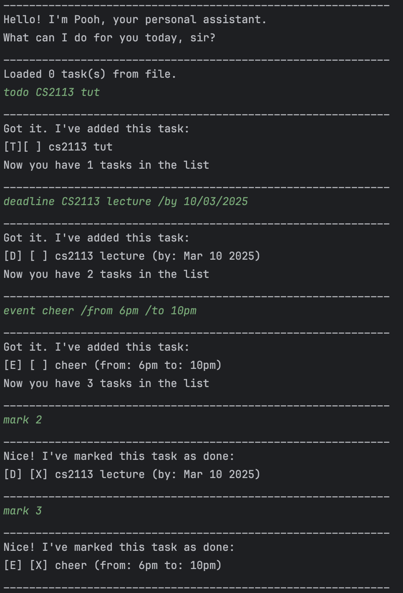
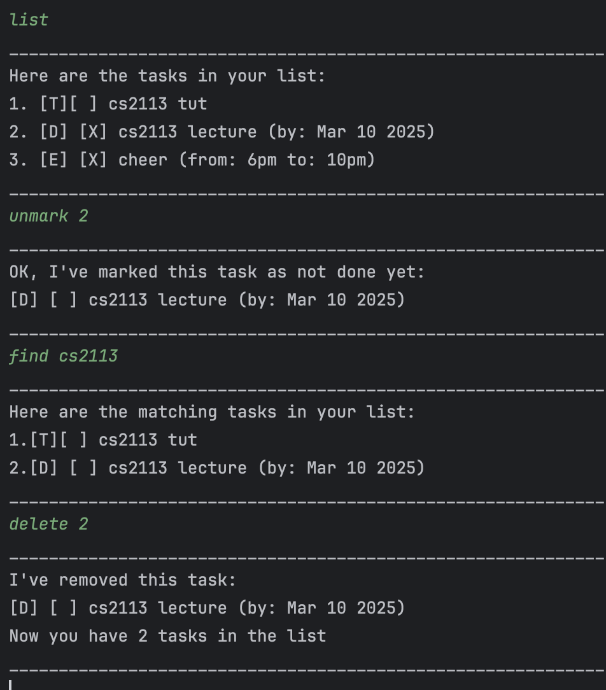

# Pooh User Guide


Pooh is a CLI based task manager application, that allows users to add, delete, mark and unmark, list and find tasks.

## Features

### Adding Tasks

Users can add tasks to the list using (todo, event and deadline)

<<<<<<< HEAD
____________________________________________________________
I've removed this task:
[E] [ ] boys trip (from: 13/05/2025 to: 19/05/2025)
Now you have 2 tasks in the list
____________________________________________________________

=======
Example: `todo return book`
>>>>>>> branch-Level-9
```
____________________________________________________________
Got it. I've added this task:
[T][ ] read book
Now you have 3 tasks in the list
____________________________________________________________
```
Example: `deadline do ee2211 assignement /by 10/03/2025`
```
____________________________________________________________
Got it. I've added this task:
[D] [ ] do ee2211 assignement (by: Mar 10 2025)
Now you have 4 tasks in the list
____________________________________________________________
``` 
Example: `event Boys Trip /from 13/05/2025 /to 19/05/2025`
```
____________________________________________________________
Got it. I've added this task:
[E] [ ] boys trip (from: 13/05/2025 to: 19/05/2025)
Now you have 5 tasks in the list
____________________________________________________________
```

## Marking and Unmarking tasks

Tasks can be marked as completed or unmarked if they are not completed.

Example: `mark 2`
```
____________________________________________________________
Nice! I've marked this task as done:
[D] [X] do ee2211 assignement (by: Mar 10 2025)
____________________________________________________________
``` 

Example: `unmark 2`
```
____________________________________________________________
OK, I've marked this task as not done yet:
[D] [ ] do ee2211 assignement (by: Mar 10 2025)
____________________________________________________________
```

### Finding tasks

Tasks can be searched by a keyword.

Example: `find assignement`
```
____________________________________________________________
Here are the matching tasks in your list:
1.[D] [ ] do ee2211 assignement (by: Mar 10 2025)
____________________________________________________________
```
### List tasks

Users can view all the tasks in the list.

Example: `list`
```
____________________________________________________________
Here are the tasks in your list:
1. [D] [ ] cs2113 lecture (by: Mar 10 2025)
2. [D] [ ] do ee2211 assignement (by: Mar 10 2025)
3. [E] [ ] boys trip (from: 13/05/2025 to: 19/05/2025)
____________________________________________________________
```

### Delete tasks

Tasks can be removed from the list.

Example: `delete 3`
```
____________________________________________________________
I've removed this task:
[E] [ ] boys trip (from: 13/05/2025 to: 19/05/2025)
Now you have 2 tasks in the list
____________________________________________________________
```
## Command summary

| Command  |                                               Format, Example                                                |
|----------|:------------------------------------------------------------------------------------------------------------:|
| Todo     |                                 todo [TASKNAME] <br/>e.g Todo cs2113 Lecture                                 |
| deadline |                 deadline [TASKNAME] /by [END DATE]<br/>e.g deadline cs2113 ip /by 10/03/2025                 |
| event    | event [TASKNAME] /from [START TIME] /to [END TIME] <br/> e.g event Boys Trip /from 13/05/2025 /to 19/05/2025 |
| mark     |                                     mark [TASK NUMBER] <br/> e.g mark 2                                      |
| unmark   |                                   unmark [TASK NUMBER] <br/> e.g unmark 2                                    |
| find     |                                     find [KEYWORD] <br/> e.g find cs2113                                     |
| list     |                                                     list                                                     |
| delete   |                                   delete [TASK NUMBER] <br/> e.g delete 2                                    |

